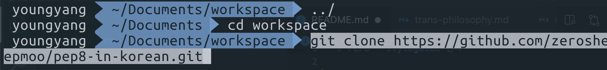
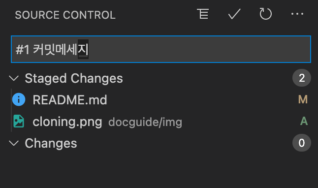

# PEP8 - styleguide 번역

## 시작하기

### 사전준비

- [git](https://git-scm.com/downloads) 설치
- 특별히 사용하는 IDE 가 없는 경우: [vscode](https://code.visualstudio.com/)를 설치
- [nodejs](https://nodejs.org/en/) LTS 버전 다운로드

### 처음에는...

> git cli 를 사용하셔도 무관합니다.

```bash
cd [workspace 디렉토리 경로]

git clone https://github.com/zerosheepmoo/pep8-in-korean.git
```



### 기여하기

> vscode 기준입니다.

- 소스 컨트롤로 들어가신 후, + 버튼을 눌러주세요!
- cli 로 `git add` 로 하셔도 상관없습니다.


- commit 메시지를 입력하고 체크표시로 커밋하세요!
- cli 로 `git commit -m "#num messeage"`로 하셔도 상관없습니다.



- push 를 해주세요! cli 도 상관없습니다.


### 팁

- 항상 pull을 먼저하세요.

- 잘못 커밋했을 때는 undo last commit 을 하세요


## collaborator 로 지원하기

- zerosheepmoo@gmail.com 로 **kakaoID**와 **github id** 를 보내주세요. 