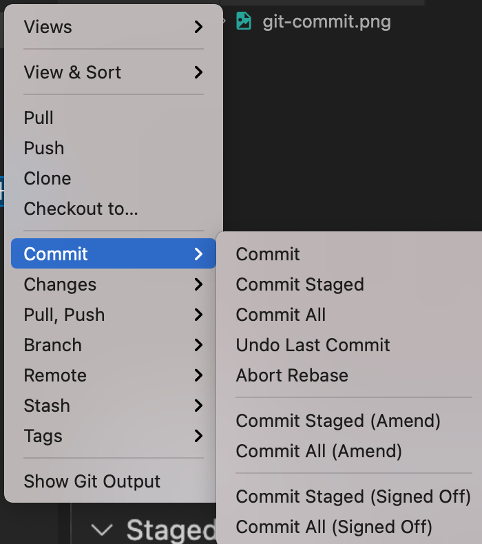

# PEP8 번역 프로젝트에 기여하는 법

## 사전준비

- [git](https://git-scm.com/downloads) 설치
- 특별히 사용하는 IDE 가 없는 경우: [vscode](https://code.visualstudio.com/)를 설치
- [nodejs](https://nodejs.org/en/) LTS 버전 다운로드

## 처음에는

> git cli 를 사용하셔도 무관합니다.

```bash
## cloning
cd [workspace 디렉토리 경로]
git clone https://github.com/zerosheepmoo/pep8-in-korean.git

# 디렉토리 이동
cd pep8-in-korean

# 패키지 매니저 설치
npm install --global yarn

# 패키지 설치
yarn install

# 테스트
yarn dev

# 이후 localhost:8080 으로 확인
```


## 협업하기

> vscode 기준입니다.

- 소스 컨트롤로 들어가신 후, + 버튼을 눌러주세요!
- cli 로 `git add` 로 하셔도 상관없습니다.


- commit 메시지를 입력하고 체크표시로 커밋하세요!
- cli 로 `git commit -m "#num messeage"`로 하셔도 상관없습니다.


- push 를 해주세요! cli 도 상관없습니다.


### 팁

- 항상 pull을 먼저하세요.
- 잘못 커밋했을 때는 undo last commit 을 하세요



## 린트

- 일관성있는 형식을 유지하기 위해 markdownlint 툴을 사용하고 있습니다.
- vscode를 사용하신다면 저장과 함께 린팅이 적용되며, 적절하지 않은 형식에 노란색 밑줄이 쳐질 것입니다.
- 그게 아니라면 메뉴얼하게
  [markdownlint](https://github.com/DavidAnson/markdownlint)
  가 안내하는 바에 따라 cli를 사용하여 체크해주세요.
- 자세한 내용은 [마크다운 스타일 가이드](./style.md)를 참조해주세요.
